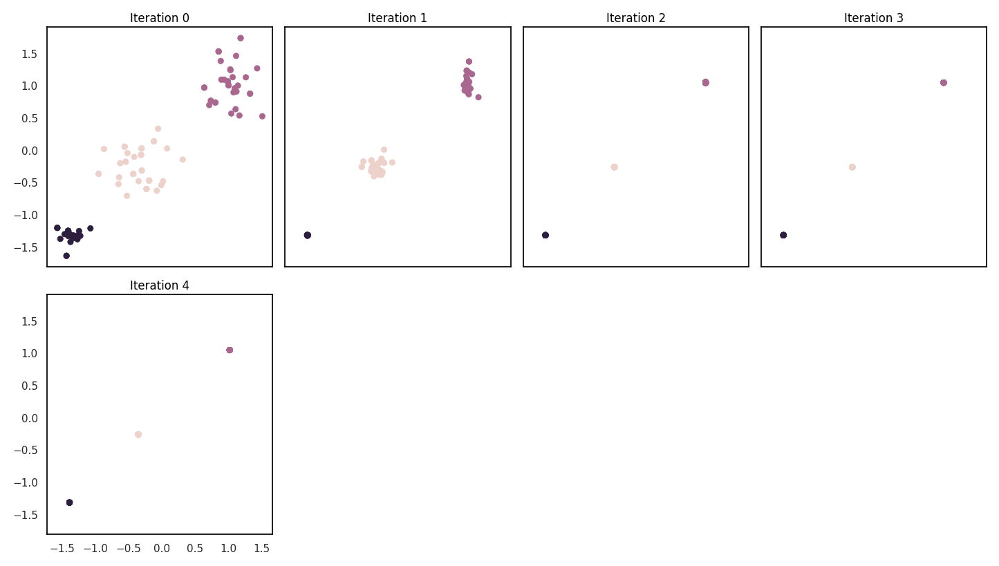
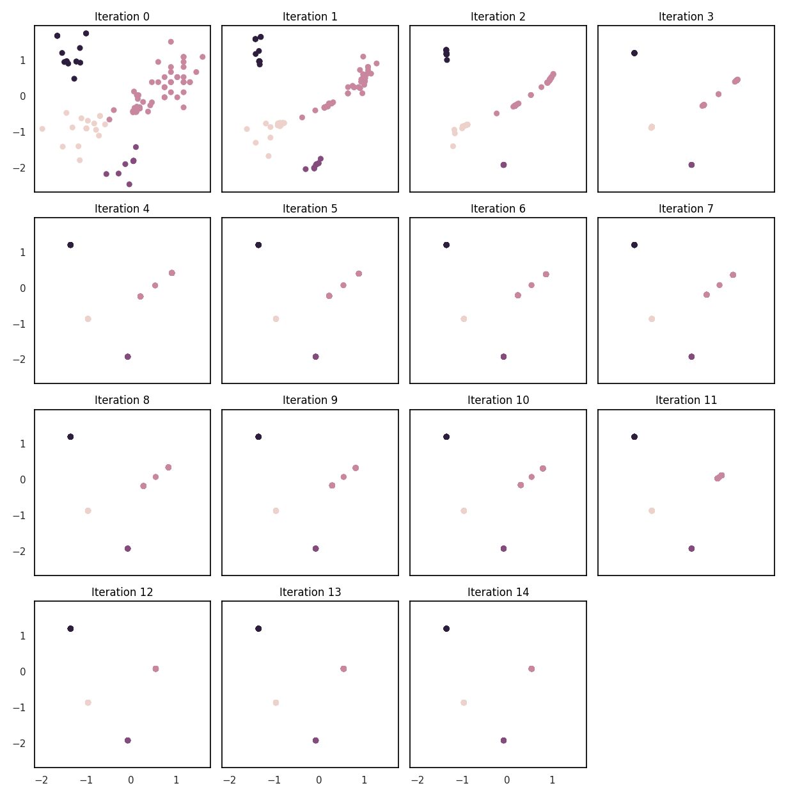
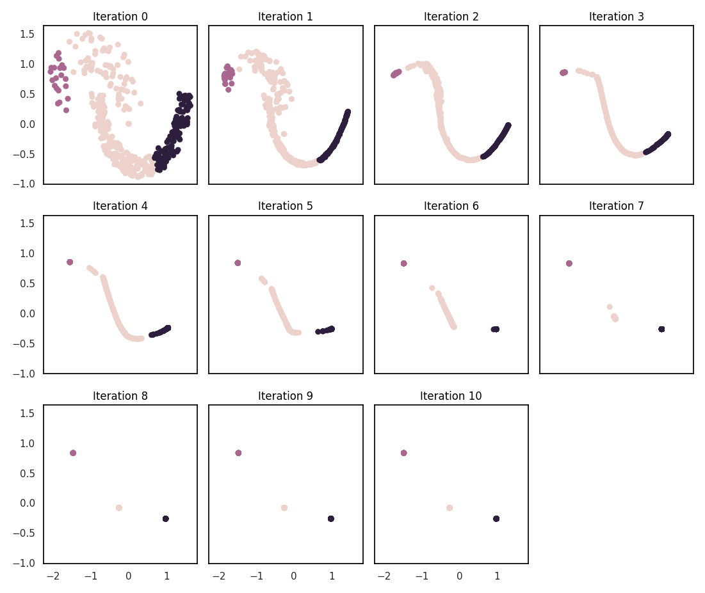

# Mean shift clustering

Mean shift is a clustering algorithm (like k-means), which identifies clusters by finding regions of the data with the highest density. The algorithm takes each data point to be initial estimates for these modes, and proceeds iteratively. At every point $x$, a kernel function is used to take a weighted mean of the surrounding points $m(x)$, and then $x$ is updated to $m(x)$.

## Motivation

This implementation of mean shift in FAISS was developed as a final project for [COS 597A](https://edoliberty.github.io/vector-search-class-notes/) (Long Term Memory in AI - Vector Search and Databases) held at Princeton University in Fall 2023. The rationale for choosing this project was twofold: first, to provide an alternative to k-means in FAISS, and second, to leverage FAISS to create a performant implementation of mean shift.

Clustering is a core part of the FAISS internals because it is used for vector quantization and index training. Furthermore, because the k-means implementation is performant on large scale datasets, it is useful externally as a general purpose clustering algorithm. Although k-means is a very robust, widely used, and straightforward algorithm, having other options could still be valuable for some situations, for either internal or external use.

There are a couple of notable practical differences between k-means and mean shift. First, mean shift is a "non-parametric" algorithm, meaning that it does not impose any modeling assumptions on the data to be clustering (unlike k-means, which assumes the number of clusters $k$). It does, however, have a "bandwidth" parameter, which effectively controls the scale of the kernel. This could have interesting consequences for vector quantization, and may be a benefit or drawback depending on the situation. Second, its performance is not dependent on a random initialization, as is usually the case with k-means.

## Implementation

### Blurring mean shift

In the classic mean shift (MS) algorithm, the initial data points over which the density estimates are computed do not move. In the blurring mean shift (BMS) variant, the update happens on the original data points. This project implements BMS.

### Weighted blurring mean shift

MS and BMS typically do not perform well on high dimensional datasets, like many clustering algorithms, due to the "curse of dimensionality". This is especially notable in the context of FAISS, which is all about high dimensional vectors. [Weighted blurring mean shift](https://arxiv.org/pdf/2012.10929.pdf) (WBMS) was proposed to mitigate this issue, by using weighted Euclidean distance to emphasize the relevant dimensions, and evolving the weights between iterations. WBMS can optionally be used by setting `weighted = true`. However, the developer of this project was unable to reproduce many of the results in the WBMS paper, and found that the code provided with the paper is inconsistent with what the paper describes. It seems to perform pretty poorly in practice, but the author of the paper has been contacted for clarification.

### Kernel density estimate

A Gaussian kernel is used for the kernel density estimate (KDE), which is the standard choice for mean shift, but is easy enough to change by modifying the source. By far the most costly part of the algorithm is computing the KDE, but this can benefit from using FAISS indexes. In the case of a Gaussian kernel, since most of the mass is near the center point, truncating the kernel at a few standard deviations is a reasonable approximation. This then allows for using an index range search to find the relevant points, as opposed to considering every point in the dataset.

## Results

Following are some plots of the algorithm progression on different datasets. Due to time constraints as discussed below, the implementation does not achieve any impressive numbers for speed or accuracy in high dimensions, but the results are intended to demonstrate the correctness of the algorithm. The third example demonstrates a weak point of the algorithm. Also note that choosing the bandwidth parameter is not trivial, and `sklearn.cluster.estimate_bandwidth` is used in these tests for consistency. The listed $n$ is a subsample of the original datasets.

`dataset: wut/x1, algorithm: BMS, n: 100, d: 2, true k: 3, pred k: 3`

`dataset: wut/x3, algorithm: BMS, n: 100, d: 2, true k: 3/4, pred k: 4`

`dataset: sipu/jain, algorithm: BMS, n: 250, d: 2, true k: 2, pred k: 3`

## Contributions

- `faiss/MeanShiftClustering.cpp` and `faiss/MeanShiftClustering.h`: the core mean shift implementation and accompanying header file
- `report/wrapper.py`: a Python wrapper for the `MeanShiftClustering` struct, offering a more ergonomic interface over the plain generated Python bindings
- `report/benchmarks.py`: a script for testing the implementation and plotting results, which depends on the `clustering-benchmarks` package to run on a variety of interesting datasets

As this was developed for a university project, I was not able to devote enough time to this to make it anywhere near production ready, but may come back to it in the near future. To reach the current state, the majority of my time was spent on understanding the FAISS codebase and setting up my development environment, researching the nuances of mean shift, writing and debugging a proof of concept implementation, and generating Python bindings and writing test scripts using them. Some todos and improvements of varying importance are as follows:

- Performance
  - Parallelism
  - Vectorized operations
  - Merging points between iterations
- Explore parameter space and stopping conditions
- Try substituting NNS for range search to increase robustness across data densities
- Test on more datasets, especially high dimensional ones
- Benchmark against FAISS k-means in accuracy, speed, and quantization quality for indexes
